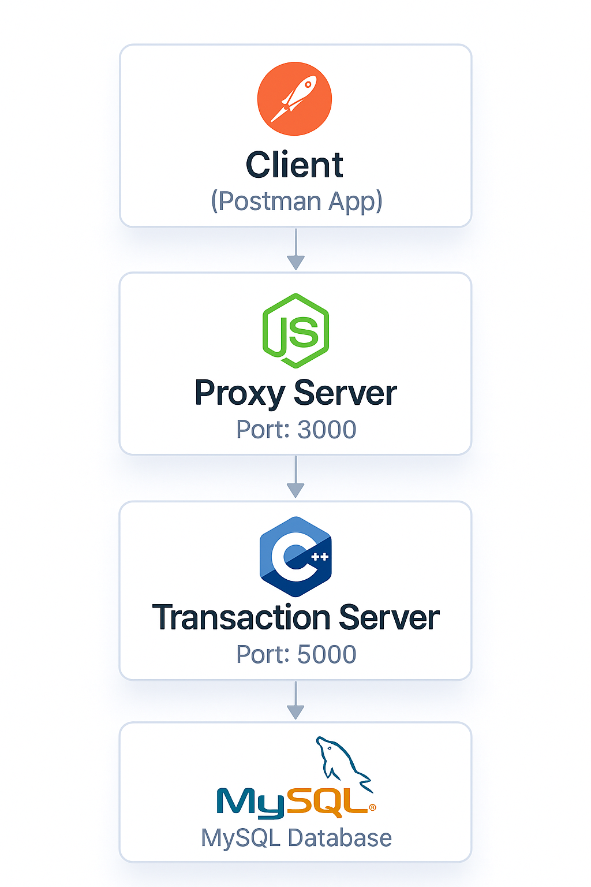

# 💰 Transaction Proxy System

A simple full-stack system designed to manage user authentication, securely forward API requests, and handle high-precision financial transactions. It is built using:

- **Node.js + Express** for authentication, user management, and request proxying
- **Crow C++ server** for fast and accurate financial transaction handling
- **MySQL** as the backend database

---

## 📦 Project Structure

```plaintext
project-root/
├── ProxyServer/            # Node.js Express API
│   ├── routes/             # Auth and proxy routes
│   ├── controllers/        # Login, signup
│   ├── middleware/         # JWT auth check
│   ├── models/             # Sequelize User model
│   ├── config/             # DB connection config
│   └── index.js            # Server entrypoint
├── TransactionServer/      # Crow C++ server
│   ├── config/             # .env loader
│   ├── database/           # MySQL connection and schema creation
│   ├── models/             # Transaction model logic
│   ├── routes/             # Crow transaction routes
│   ├── includes/           # crow_all.h
│   ├── main.cpp            # Server entrypoint
│   └── makefile
```

---

## 🧠 How It Works

### ✅ Simple Architecture Overview

```plaintext
                 +-------------------+
                 |   Thunder Client  |
                 |  (Postman/curl)   |
                 +--------+----------+
                          |
                          v
        +-----------------------------+
        |    Proxy Server (Node.js)   |
        |  /auth/signup, /auth/login  |
        |  /proxy/* (express proxy)   |
        +-----------------------------+
                          |
                          v
          +-------------------------------+
          | Transaction Server (C++ Crow) |
          |     Handles /transaction/*    |
          |   Interacts with MySQL DB     |
          +-------------------------------+
```

- 🧍 Users authenticate via `/auth/login` → JWT issued
- 🕵️‍♂️ All `/proxy/*` requests require a valid token
- 🚀 Proxy forwards to the C++ server, which processes and stores the transaction
- 💾 Data is saved into the MySQL `transactions` table

---

### 🗺️ Visual Deployment Architecture




## 🛠️ Setup Instructions

### 1. Clone the repo and set up MySQL

Create a database named:

```sql
CREATE DATABASE transledger;
```

### 2. Proxy Server (Node.js)

```bash
cd ProxyServer
npm install
touch .env
```

**`.env` file:**

```env
PORT=3000
DBHOST=localhost
DBUSER=root
DBPASS=your_password
DBNAME=transledger
JWT_SECRET=supersecuresecret
```

**Install dependencies:**

```bash
npm install express sequelize mysql2 jsonwebtoken bcryptjs express-http-proxy dotenv
```

**Start the server:**

```bash
node index.js
```

---

### 3. Transaction Server (C++ Crow)

**Prerequisites:**

- Install Crow framework
- Install MySQL C++ connector
- Install nlohmann/json library

```bash
cd TransactionServer
make
./server
```

> This server will auto-create the `transactions` table if it doesn't exist.

---

## 🔐 Authentication API (Node.js)

### ✅ Signup

```http
POST /auth/signup
```

**Body:**

```json
{
  "username": "Hydra",
  "password": "secure123"
}
```

### ✅ Login

```http
POST /auth/login
```

**Body:**

```json
{
  "username": "Hydra",
  "password": "secure123"
}
```

**Response:**

```json
{
  "token": "your_jwt_token"
}
```

---

## 🔁 Proxy to C++ API (Requires Token)

All requests must include the header:

```
Authorization: Bearer <token>
```

### ✅ Create Transaction

```http
POST /proxy/transaction/create
```

**Body:**

```json
{
  "user_id": 1,
  "amount": 1500.75,
  "type": "deposit"
}
```

**Response:**

```json
"Transaction created"
```

---

## 🗄️ C++ Server Auto-Creates Table

C++ will ensure the following MySQL schema exists:

```sql
CREATE TABLE IF NOT EXISTS transactions (
    id INT AUTO_INCREMENT PRIMARY KEY,
    user_id INT NOT NULL,
    amount DECIMAL(15,2) NOT NULL,
    type VARCHAR(50) NOT NULL,
    status VARCHAR(50) NOT NULL DEFAULT 'pending',
    created_at TIMESTAMP DEFAULT CURRENT_TIMESTAMP
);
```

---

## 🧪 Example Workflow

```bash
# 1. Signup & Login
curl -X POST http://localhost:3000/auth/signup \
  -H "Content-Type: application/json" \
  -d '{"username":"Hydra", "password":"secure123"}'

curl -X POST http://localhost:3000/auth/login \
  -H "Content-Type: application/json" \
  -d '{"username":"Hydra", "password":"secure123"}'

# 2. Create transaction using token
curl -X POST http://localhost:3000/proxy/transaction/create \
  -H "Authorization: Bearer <token>" \
  -H "Content-Type: application/json" \
  -d '{"user_id":1, "amount":100.50, "type":"deposit"}'
```

---

## 🚀 Technologies Used

| Technology | Role                           |
|------------|-------------------------------|
| Node.js    | Proxy + Auth server           |
| Express    | HTTP server + middleware      |
| Sequelize  | ORM for MySQL                 |
| JWT        | User authentication           |
| Crow (C++) | Fast backend transaction logic|
| MySQL      | Persistent DB storage         |
| express-http-proxy | Request forwarding    |

---

## 📋 Dependencies

### Node.js (ProxyServer)
```json
{
  "express": "^4.18.2",
  "sequelize": "^6.32.1",
  "mysql2": "^3.6.0",
  "jsonwebtoken": "^9.0.2",
  "bcryptjs": "^2.4.3",
  "express-http-proxy": "^2.0.0",
  "dotenv": "^16.3.1"
}
```

### C++ (TransactionServer)
- Crow framework
- MySQL C++ Connector
- nlohmann/json

---

## 🔧 Configuration

### Environment Variables

**ProxyServer/.env:**
```env
PORT=3000
DBHOST=localhost
DBUSER=root
DBPASS=your_mysql_password
DBNAME=transledger
JWT_SECRET=your_jwt_secret_key
```

**TransactionServer/.env:**
```env
DB_HOST=localhost
DB_USER=root
DB_PASS=your_mysql_password
DB_NAME=transledger
DB_PORT=3306
```

---

## 📬 Future Enhancements

- Add `GET /transactions` history per user
- Add admin dashboards
- Add transaction rollback or status update routes
- Use Redis or message queues for buffering
- Add rate limiting and request validation
- Implement transaction status tracking
- Add comprehensive error handling and logging

---

## 🧑‍💻 Author

**Frank Gondwe**  
Built to demonstrate secure, multi-language service architecture.
